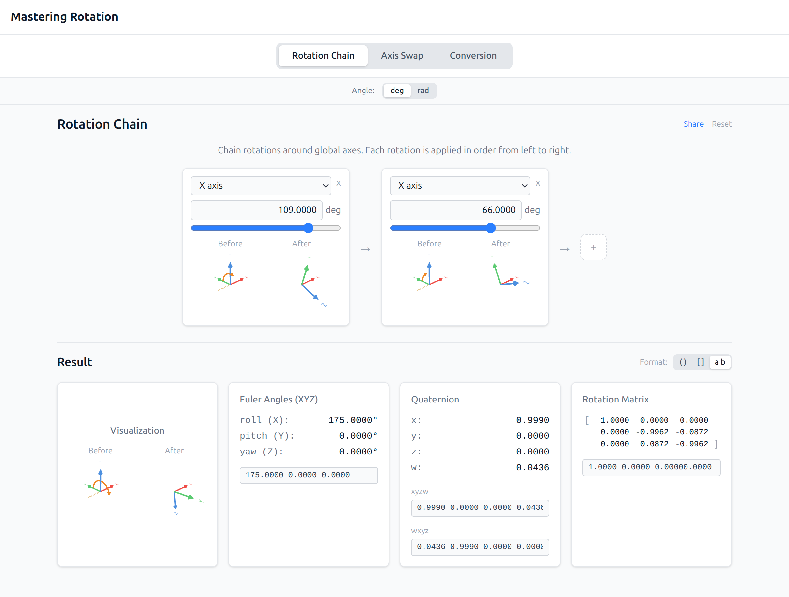
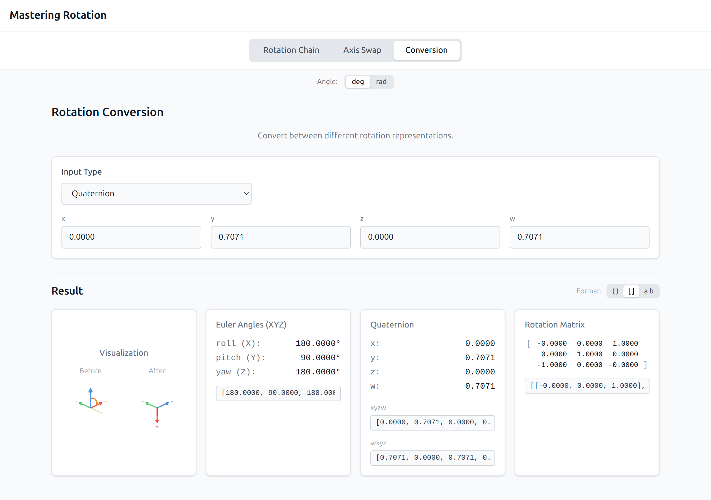

# mastering rotation

Rotation is the one thing we all end up doing every day.

You try to compute a quaternion or rotation matrix and suddenly you’re stuck on classics:

> “Which direction is this transform again?”

> “Euler angles → quaternion… what was the convention?”

> “If I swap these axes, what rotation does that correspond to?”

Next thing you know, you’ve asked ChatGPT, received an answer with maximum confidence and minimum correctness, and lost another chunk of your day.

It’s time for mastering-rotation, which provides a few small, frequently-used rotation calculators with a clean, simple UI.

Will this actually help you master rotation math? ...maybe.

## Usage

### Rotation Chain
In this tab you can compute the composed conversion of chained rotations around each axis. 

### Axis Swap
In this tab you can compute the rotation to swap axes like (x, y, z) <- (-z, y, x).

### Conversion
In this tab you can convert a rotation to another representation.

